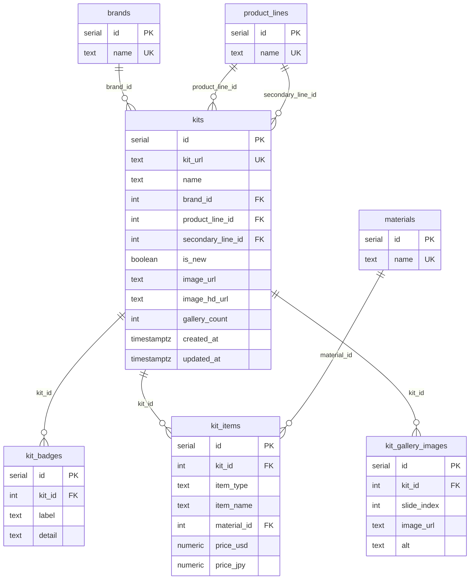

# Base de datos — Catálogo Liberty Walk MX

Este documento explica la base de datos relacional que respalda el catálogo de body kits Liberty Walk para libertywalkmx: de dónde salen los datos, cómo está modelado el esquema, y cómo está desplegada en **Supabase** (PostgreSQL administrado).

## Resumen

- **Motor:** PostgreSQL, hospedado en [Supabase](https://supabase.com).
- **Origen de los datos:** scraping de [libertywalk.co.jp](https://libertywalk.co.jp) ([`script.py`](script.py)), que genera 3 CSV planos.
- **Esquema:** 7 tablas normalizadas (`schema.sql`) que relacionan marcas, líneas de producto, kits, badges, variantes de precio y galería de imágenes.
- **Carga de datos:** SQL generado automáticamente a partir de los CSV ([`generate_seed_sql.py`](generate_seed_sql.py) → [`seed_sql/`](seed_sql)), pensado para pegarse directamente en el **SQL Editor de Supabase**.
- **Estado actual:** 105 kits, 27 marcas, 8 líneas de producto, 53 materiales, 1102 variantes de precio (`kit_items`) y 1509 imágenes de galería — verificado con [`seed_sql/06_verify.sql`](seed_sql/06_verify.sql).

## Por qué existe esta base de datos

El scraper original ([`script.py`](script.py)) escribe 3 CSV desnormalizados:

| CSV | Contenido |
|---|---|
| [`lbwmx_catalog.csv`](lbwmx_catalog.csv) | Un kit por fila: nombre, marca, línea de producto, si es nuevo, badge, URL, imágenes. |
| [`lbwmx_catalog_detalle.csv`](lbwmx_catalog_detalle.csv) | Una fila por variante de precio (kit completo o pieza individual), repitiendo los datos del kit en cada fila. |
| [`lbwmx_catalog_galeria.csv`](lbwmx_catalog_galeria.csv) | Una fila por imagen de galería, repitiendo también los datos del kit. |

Los tres comparten `kit_url` como llave natural, pero al ser CSV planos no hay forma de consultarlos ni relacionarlos de manera eficiente (por ejemplo: "dame todos los kits de Nissan con su precio más barato y su primera imagen"). La base de datos normaliza esta información para que el sitio (o cualquier herramienta interna) pueda consultarla con SQL en vez de procesar CSV a mano.

## Esquema (ERD)



## Tablas

### `brands`
Catálogo de marcas de vehículo (Nissan, Toyota, Lamborghini, Ferrari, ...). 27 filas actualmente.

### `product_lines`
Líneas de producto de Liberty Walk (`LB-WORKS`, `LB-Silhouette WORKS GT`, `lb★nation`, `LB★PERFORMANCE`, `LB-TRUCKS`, `LB-CLASSICS`, `Sin línea`, `Limited Edition`). Se usa dos veces en `kits`: como línea principal (`product_line_id`) y como línea secundaria (`secondary_line_id`, viene de la columna `extra_lines` del CSV — algunos kits muestran un segundo tag, por ejemplo un kit de línea `lb★nation` etiquetado también como `LB-WORKS`).

### `materials`
Materiales/acabados de las piezas tal como aparecen en el sitio (`FRP`, `CFRP`, `Dry`, `Forged`, `Casting`, `LED`, ...). Se guardan literales, sin intentar unificar variantes de formato (`BK` vs `Black` vs `BLACK` quedan como filas distintas).

### `kits`
Entidad central — una fila por kit. Incluye la URL del kit en el sitio origen (`kit_url`, llave natural única), si está marcado como nuevo, imágenes principal y HD, y cantidad de imágenes de galería. `updated_at` se actualiza automáticamente por un trigger en cada `UPDATE`.

### `kit_badges`
Badges especiales del kit (ej. `"Limited Edition | 35 Sets SOLD OUT"`), separados en `label` y `detail`. Un kit puede tener 0 o más badges. Actualmente 4 kits tienen badge.

### `kit_items`
Las variantes de precio de cada kit: kit completo (`item_type = 'COMPLETE'`) o pieza individual (`item_type = 'SINGLE_PART'`), con su material y precio en USD y JPY. Es la tabla más grande (1102 filas): 283 kits completos y 819 piezas individuales.

### `kit_gallery_images`
Imágenes de galería por kit, con su índice de orden (`slide_index`) y texto alternativo. 1509 filas.

## Por qué está en Supabase

Supabase provee PostgreSQL administrado con una capa REST/API automática y un SQL Editor en el navegador. Para este proyecto se usa principalmente como:

- **Base de datos de origen** para el catálogo que consume el landing page.
- **SQL Editor** como forma de correr el esquema y cargar los datos sin necesitar un cliente `psql` local (útil porque en el entorno de desarrollo no siempre hay PostgreSQL instalado).

No hay nada específico de Supabase en el esquema (`schema.sql` es PostgreSQL estándar) — el proyecto podría migrarse a cualquier otro Postgres sin cambios.

## Cómo actualizar los datos después de un nuevo scrape

```
python script.py                # regenera los 3 CSV
python generate_seed_sql.py     # regenera seed_sql/ a partir de los CSV nuevos
```

Todos los archivos de `seed_sql/` son **idempotentes** (usan `ON CONFLICT ... DO UPDATE/NOTHING`, o un `DELETE` + `INSERT` acotado en el caso de `kit_badges`), así que se pueden volver a correr sobre una base ya poblada sin duplicar datos: actualizan lo que cambió y agregan lo nuevo.

## Verificación

[`seed_sql/06_verify.sql`](seed_sql/06_verify.sql) contiene 3 chequeos, generados dinámicamente a partir de los CSV (los números esperados siempre están sincronizados con la última carga):

1. **Conteos por tabla** — compara cada tabla contra el número esperado y marca `OK` / `MISMATCH`.
2. **Integridad / huérfanos** — 6 chequeos que deben dar todos `0` (registros sin marca, `kit_url` duplicados, campos vacíos, filas sin FK válida).
3. **Muestra puntual** — trae un kit conocido con sus conteos reales para comparar contra el valor esperado indicado en el comentario.
