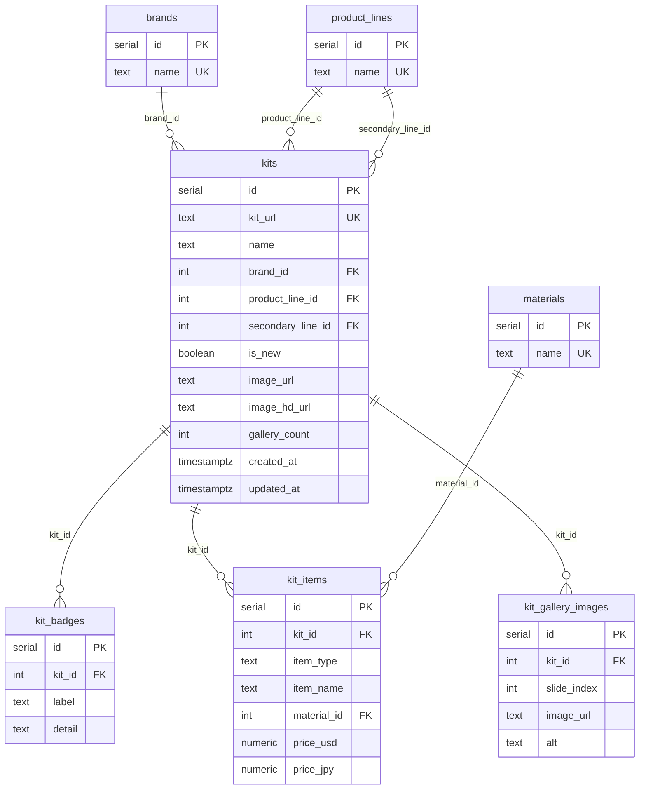

# Base de datos — Catálogo Liberty Walk MX

Este documento explica la base de datos relacional que respalda el catálogo de body kits Liberty Walk para libertywalkmx: de dónde salen los datos, cómo está modelado el esquema, y cómo está desplegada en **Supabase** (PostgreSQL administrado).

## Resumen

- **Motor:** PostgreSQL, hospedado en [Supabase](https://supabase.com).
- **Origen de los datos:** scraping de [libertywalk.co.jp](https://libertywalk.co.jp) ([`script.py`](script.py)), que genera 3 CSV planos.
- **Esquema:** 7 tablas normalizadas (`schema.sql`) que relacionan marcas, líneas de producto, kits, badges, variantes de precio y galería de imágenes.
- **Carga de datos:** SQL generado automáticamente a partir de los CSV ([`generate_seed_sql.py`](generate_seed_sql.py) → [`seed_sql/`](seed_sql)), pensado para pegarse directamente en el **SQL Editor de Supabase**.
- **Eventos:** tabla independiente `events` para la sección `/eventos`. Ver [Eventos](#eventos).
- **Estado actual:** 105 kits, 27 marcas, 8 líneas de producto, 53 materiales, 1102 variantes de precio (`kit_items`) y 1509 imágenes de galería — verificado con [`seed_sql/06_verify.sql`](seed_sql/06_verify.sql).

## Por qué existe esta base de datos

El scraper original ([`script.py`](script.py)) escribe 3 CSV desnormalizados:

| CSV | Contenido |
|---|---|
| [`lbwmx_catalog.csv`](lbwmx_catalog.csv) | Un kit por fila: nombre, marca, línea de producto, si es nuevo, badge, URL, imágenes. |
| [`lbwmx_catalog_detalle.csv`](lbwmx_catalog_detalle.csv) | Una fila por variante de precio (kit completo o pieza individual), repitiendo los datos del kit en cada fila. |
| [`lbwmx_catalog_galeria.csv`](lbwmx_catalog_galeria.csv) | Una fila por imagen de galería, repitiendo también los datos del kit. |

Los tres comparten `kit_url` como llave natural, pero al ser CSV planos no hay forma de consultarlos ni relacionarlos de manera eficiente (por ejemplo: "dame todos los kits de Nissan con su precio más barato y su primera imagen"). La base de datos normaliza esta información para que el sitio (o cualquier herramienta interna) pueda consultarla con SQL en vez de procesar CSV a mano.

## Esquema (ERD)


```mermaid
erDiagram
    brands ||--o{ kits : "brand_id"
    product_lines ||--o{ kits : "product_line_id"
    product_lines ||--o{ kits : "secondary_line_id"
    kits ||--o{ kit_badges : "kit_id"
    kits ||--o{ kit_items : "kit_id"
    kits ||--o{ kit_gallery_images : "kit_id"
    materials ||--o{ kit_items : "material_id"

    brands {
        serial id PK
        text name UK
    }
    product_lines {
        serial id PK
        text name UK
    }
    materials {
        serial id PK
        text name UK
    }
    kits {
        serial id PK
        text kit_url UK
        text name
        int brand_id FK
        int product_line_id FK
        int secondary_line_id FK
        boolean is_new
        text image_url
        text image_hd_url
        int gallery_count
        timestamptz created_at
        timestamptz updated_at
    }
    kit_badges {
        serial id PK
        int kit_id FK
        text label
        text detail
    }
    kit_items {
        serial id PK
        int kit_id FK
        text item_type
        text item_name
        int material_id FK
        numeric price_usd
        numeric price_jpy
    }
    kit_gallery_images {
        serial id PK
        int kit_id FK
        int slide_index
        text image_url
        text alt
    }
```

## Tablas

### `brands`
Catálogo de marcas de vehículo (Nissan, Toyota, Lamborghini, Ferrari, ...). 27 filas actualmente.

### `product_lines`
Líneas de producto de Liberty Walk (`LB-WORKS`, `LB-Silhouette WORKS GT`, `lb★nation`, `LB★PERFORMANCE`, `LB-TRUCKS`, `LB-CLASSICS`, `Sin línea`, `Limited Edition`). Se usa dos veces en `kits`: como línea principal (`product_line_id`) y como línea secundaria (`secondary_line_id`, viene de la columna `extra_lines` del CSV — algunos kits muestran un segundo tag, por ejemplo un kit de línea `lb★nation` etiquetado también como `LB-WORKS`).

### `materials`
Materiales/acabados de las piezas tal como aparecen en el sitio (`FRP`, `CFRP`, `Dry`, `Forged`, `Casting`, `LED`, ...). Se guardan literales, sin intentar unificar variantes de formato (`BK` vs `Black` vs `BLACK` quedan como filas distintas).

### `kits`
Entidad central — una fila por kit. Incluye la URL del kit en el sitio origen (`kit_url`, llave natural única), si está marcado como nuevo, imágenes principal y HD, y cantidad de imágenes de galería. `updated_at` se actualiza automáticamente por un trigger en cada `UPDATE`.

### `kit_badges`
Badges especiales del kit (ej. `"Limited Edition | 35 Sets SOLD OUT"`), separados en `label` y `detail`. Un kit puede tener 0 o más badges. Actualmente 4 kits tienen badge.

### `kit_items`
Las variantes de precio de cada kit: kit completo (`item_type = 'COMPLETE'`) o pieza individual (`item_type = 'SINGLE_PART'`), con su material y precio en USD y JPY. Es la tabla más grande (1102 filas): 283 kits completos y 819 piezas individuales.

### `kit_gallery_images`
Imágenes de galería por kit, con su índice de orden (`slide_index`) y texto alternativo. 1509 filas.

## Por qué está en Supabase

Supabase provee PostgreSQL administrado con una capa REST/API automática y un SQL Editor en el navegador. Para este proyecto se usa principalmente como:

- **Base de datos de origen** para el catálogo que consume el landing page.
- **SQL Editor** como forma de correr el esquema y cargar los datos sin necesitar un cliente `psql` local (útil porque en el entorno de desarrollo no siempre hay PostgreSQL instalado).

No hay nada específico de Supabase en el esquema (`schema.sql` es PostgreSQL estándar) — el proyecto podría migrarse a cualquier otro Postgres sin cambios.

## Cómo actualizar los datos después de un nuevo scrape

```
python script.py                # regenera los 3 CSV
python generate_seed_sql.py     # regenera seed_sql/ a partir de los CSV nuevos
```

Todos los archivos de `seed_sql/` son **idempotentes** (usan `ON CONFLICT ... DO UPDATE/NOTHING`, o un `DELETE` + `INSERT` acotado en el caso de `kit_badges`), así que se pueden volver a correr sobre una base ya poblada sin duplicar datos: actualizan lo que cambió y agregan lo nuevo.

## Verificación

[`seed_sql/06_verify.sql`](seed_sql/06_verify.sql) contiene 3 chequeos, generados dinámicamente a partir de los CSV (los números esperados siempre están sincronizados con la última carga):

1. **Conteos por tabla** — compara cada tabla contra el número esperado y marca `OK` / `MISMATCH`.
2. **Integridad / huérfanos** — 6 chequeos que deben dar todos `0` (registros sin marca, `kit_url` duplicados, campos vacíos, filas sin FK válida).
3. **Muestra puntual** — trae un kit conocido con sus conteos reales para comparar contra el valor esperado indicado en el comentario.

## Eventos

La sección [/eventos](app/eventos/page.tsx) lee de una tabla aparte, `events`, que no tiene relación con el catálogo. Se crea pegando [`supabase/events.sql`](supabase/events.sql) completo en el **SQL Editor de Supabase**. El script es idempotente y ya trae el primer evento: la rueda de prensa del lanzamiento del 11 de mayo de 2026.

Mientras la tabla no exista, el sitio sigue funcionando: `/eventos` muestra un aviso de "muy pronto", el home muestra el video de lanzamiento y el build solo imprime un aviso en consola.

La tabla es a propósito una sola, para que el futuro panel de administración sea un solo formulario.

| Columna | Uso |
|---|---|
| `slug` | URL del evento: `/eventos/<slug>`. Minúsculas, números y guiones. |
| `title`, `event_type` | Nombre y tipo libre ("Rueda de prensa", "Exhibición", "Meet"...). |
| `starts_on`, `ends_on` | Fechas. `ends_on` solo si dura varios días. |
| `time_label` | Horario en texto libre ("12:00 PM", "11:00 a 19:00 h"). |
| `venue`, `city`, `address`, `maps_url` | Lugar. Solo `city` es obligatoria. |
| `summary` | Una o dos líneas para la tarjeta. |
| `description` | Texto de la ficha. Una línea en blanco separa párrafos. |
| `cover_url`, `gallery_urls`, `video_url` | Póster o foto principal, lista de fotos y video. |
| `external_url` | Link opcional: registro, boletos, post de Instagram. |
| `is_published` | `false` funciona como borrador: no aparece en el sitio. |
| `featured_on_home` | `true` hace que el home muestre ese evento en lugar del video de lanzamiento. |

Reglas importantes:

- **Próximo, en curso o pasado no se guarda.** El sitio lo calcula con `starts_on` / `ends_on` y la fecha de hoy en CDMX ([`lib/events.ts`](lib/events.ts)). Un evento pasa solo a "Finalizado" cuando termina.
- **Orden.** `/eventos` lista todo del más reciente al más antiguo. Los próximos y en curso salen en tarjetas negras grandes y los finalizados en una cuadrícula clara, en blanco y negro.
- **Seguridad.** RLS permite a la llave `anon` leer solo eventos publicados. No hay políticas de escritura: por ahora los eventos se agregan desde el SQL Editor.
- **Imágenes.** El script crea el bucket público `events` en Supabase Storage para que el panel de administración suba fotos. Mientras tanto sirve cualquier URL pública o una ruta de `public/`.
- **Tiempo de actualización.** Las páginas se revalidan cada hora, así que un cambio en la tabla tarda como máximo una hora en verse. El futuro panel puede llamar a `revalidatePath("/eventos")` al guardar para que se vea al instante.

Ejemplo para agregar un evento desde el SQL Editor:

```sql
insert into public.events (slug, title, event_type, starts_on, ends_on, time_label, venue, city, summary, cover_url, is_published)
values ('expo-ejemplo-2026', 'Liberty Walk en Expo Ejemplo', 'Exhibición', '2026-11-14', '2026-11-15', '11:00 a 19:00 h', 'Centro de convenciones', 'Guadalajara', 'Exhibición de autos con kits Liberty Walk.', 'https://…/poster.jpg', true);
```

## Panel de administración (/admin)

El sitio tiene una sección privada en [`/admin`](app/admin) para que los encargados agreguen, editen y eliminen eventos y suban sus fotos sin tocar SQL. Está pensada para crecer: body kits, blog, etc. se agregan como nuevas secciones (ver [`lib/admin/sections.ts`](lib/admin/sections.ts)).

### Puesta en marcha (una sola vez)

1. Correr [`supabase/events.sql`](supabase/events.sql) en el SQL Editor (si no se ha corrido).
2. Correr [`supabase/admin.sql`](supabase/admin.sql): crea `admin_users`, la función `public.is_admin()` y las políticas que dejan escribir en `events` y en el bucket `events` solo a los admins.
3. Por cada encargado: crear su usuario en **Authentication → Users → Add user** (con "Auto Confirm User") y luego, en el SQL Editor:

```sql
insert into public.admin_users (user_id, email)
select id, email from auth.users where email = 'correo@ejemplo.com'
on conflict (user_id) do nothing;
```

4. Recomendado: en **Authentication → Sign In / Providers**, desactivar "Allow new users to sign up".

Para quitarle el acceso a alguien: `delete from public.admin_users where email = '...';` (o borrar su usuario en Authentication).

### Cómo está protegido

- **[`proxy.ts`](proxy.ts)** (el "middleware" de Next 16): refresca la sesión y manda a `/admin/login` a quien no tiene sesión.
- **`requireAdmin()`** ([`lib/admin/auth.ts`](lib/admin/auth.ts)): cada página y cada acción del panel confirma que la sesión sea de alguien en `admin_users`.
- **RLS en Supabase**: aunque alguien se saltara la app, la base solo deja escribir a quien pase `public.is_admin()`. No se usa la llave privada (service role) en ningún lado.

### Fotos

Se suben directo del navegador al bucket `events` con la sesión del encargado, después de reducirlas a máx. 2000 px y convertirlas a WebP. Al quitar una foto de un evento y guardar, o al eliminar el evento, sus archivos se borran del bucket.

### Agregar una sección nueva

1. Sumar una entrada en [`lib/admin/sections.ts`](lib/admin/sections.ts) (aparece sola en el menú y en el inicio del panel).
2. Crear sus páginas en `app/admin/(panel)/<seccion>/` llamando a `requireAdmin()` en cada página y acción.
3. Darle a sus tablas políticas RLS con `public.is_admin()`, igual que `supabase/admin.sql` hace con `events`.
